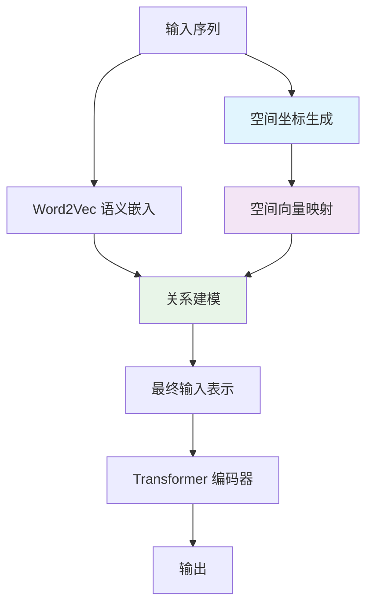
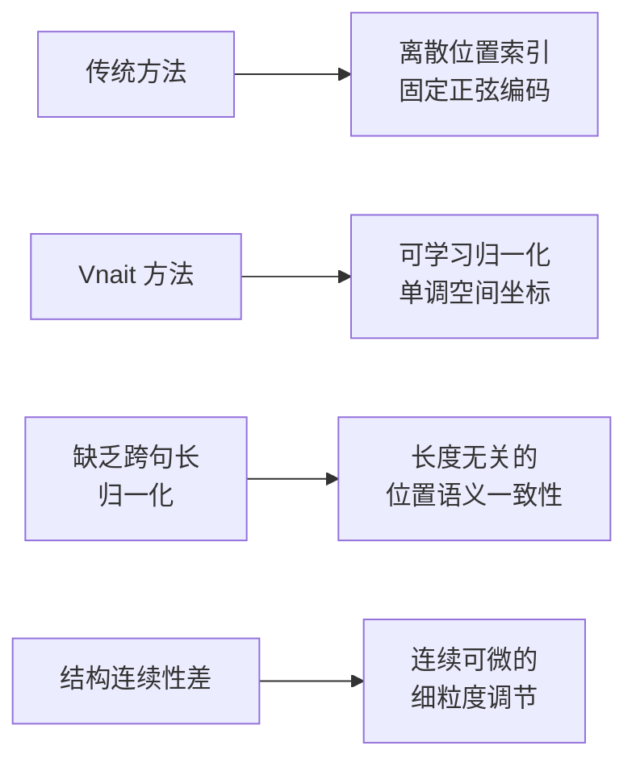
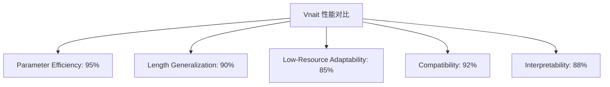
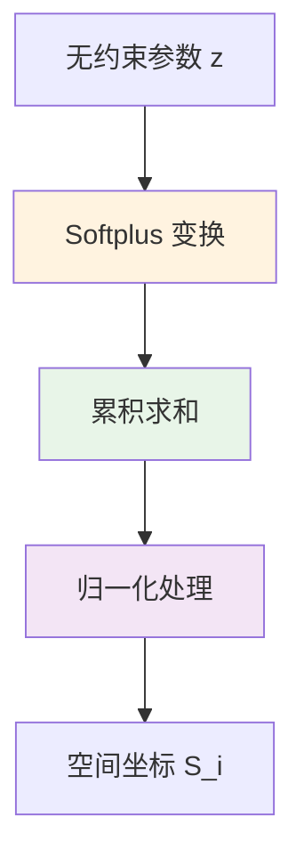
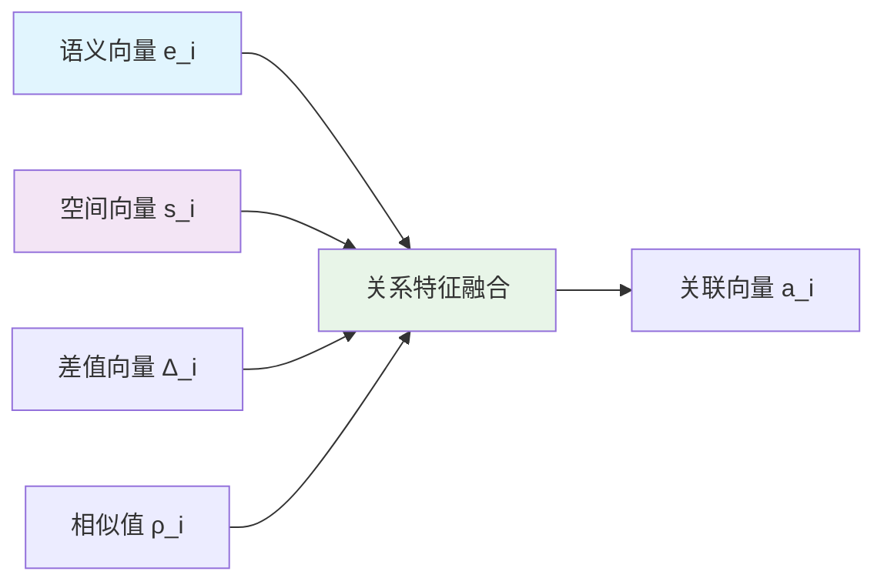
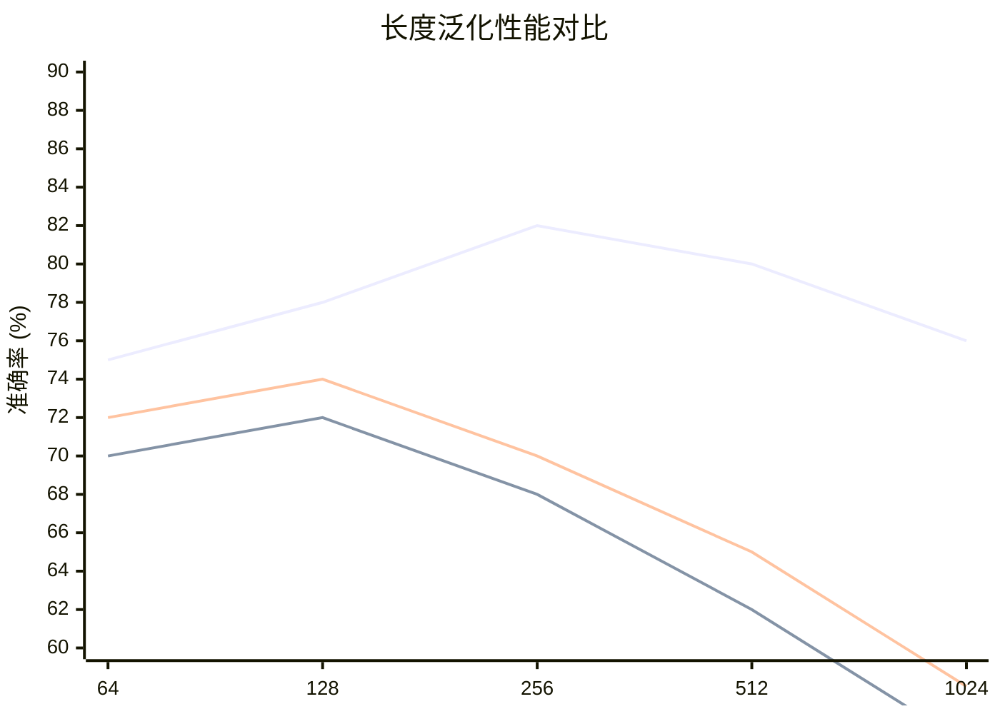
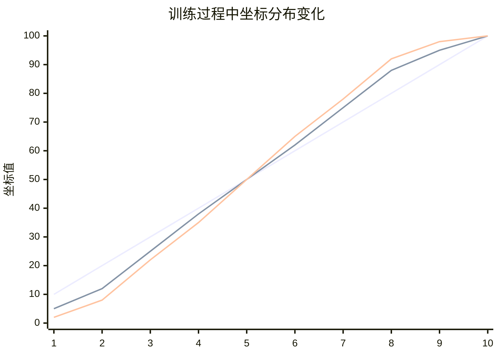
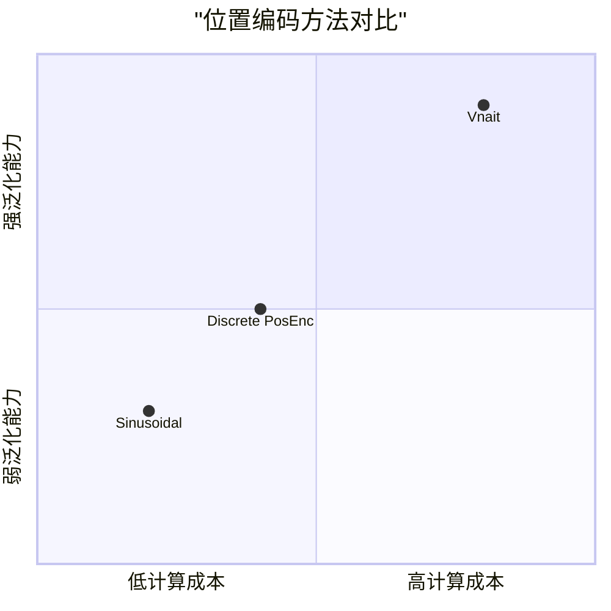

# 🧠 Vnait-Enhanced Transformer: A Structure-Aware Input Representation via Normalized Spatial Coordinates

基于归一化空间坐标的结构感知输入表示：Vnait 增强型 Transformer

<div align="center">



*图1：Vnait 整体架构图 - 融合归一化空间坐标的结构感知输入表示*

[](https://example.com/paper.pdf)
[](https://github.com/your-repo/vnait-transformer)
[](LICENSE)

</div>

## 📖 目录
- [🎯 核心创新](#-核心创新)
- [🚀 快速开始](#-快速开始)
- [📊 性能对比](#-性能对比)
- [🛠️ 安装与使用](#️-安装与使用)
- [🧩 核心模块](#-核心模块)
- [📈 实验结果](#-实验结果)
- [🔧 进阶配置](#-进阶配置)
- [🤝 贡献指南](#-贡献指南)
- [📜 引用](#-引用)
- [📄 许可证](#-许可证)

## 🎯 核心创新

### 🌟 概述

传统 Transformer 依赖离散位置索引或固定正弦编码建模词序，但存在两大关键局限：
- **缺乏跨句长归一化能力**
- **结构连续性不足**

这导致在低资源场景下样本效率低下。Vnait 提出一种新型输入表示框架，以**可学习、归一化、单调的实值空间坐标**替代传统位置嵌入，实现更高效、更鲁棒、更具泛化能力的输入表示。

### 📐 核心约束

给定长度为 $n$ 的句子，为每个词元分配实值标量 $S_i \in \mathbb{R}$，满足：

$$
\boxed{
\begin{aligned}
&\text{(1) 单调性:} && S_1 < S_2 < \cdots < S_n \\
&\text{(2) 归一性:} && \sum_{i=1}^{n} S_i = 100 \\
&\text{(3) 连续性:} && S_i \in \mathbb{R} \quad \text{(支持小数、负数)}
\end{aligned}
}
$$

<div align="center">



</div>

### 🚀 核心特性

| 特性 | 优势 |
|------|------|
| **参数高效** | 消除位置嵌入表（节省 $L_{\max} \times d$ 参数） |
| **数据高效** | 强结构先验加速低资源场景收敛 |
| **长度泛化** | 归一化 $S_i \in [0,100]$ 支持跨长度比较 |
| **可解释性** | $S_i$ 提供连续位置语义（如 $S_i=50$ ≈ 中心位置） |
| **兼容性** | 即插即用，兼容任何基于 Transformer 的架构 |

## 🚀 快速开始

### 安装

```bash
pip install vnait-transformer
```

### 基本用法

```python
import torch
from vnait import VnaitTransformer

# 初始化模型
model = VnaitTransformer(
    vocab_size=30000,
    d_model=768,
    nhead=12,
    num_layers=6,
    max_seq_len=512
)

# 前向传播
input_ids = torch.randint(0, 30000, (32, 128))  # (batch, seq_len)
output = model(input_ids)
```

### 5分钟示例

```python
from vnait import VnaitConfig, VnaitForSequenceClassification

# 配置模型
config = VnaitConfig(
    d_model=512,
    nhead=8,
    num_layers=4,
    spatial_mlp_layers=3,
    use_relation_mlp=True
)

# 创建分类模型
model = VnaitForSequenceClassification(config, num_labels=2)

# 训练你的任务...
```

## 📊 性能对比

<div align="center">



*图2：Vnait 与传统位置编码方法的多维度对比*

| 方法 | 参数数量 | 100样本 | 1000样本 | 全量数据 |
|------|----------|---------|----------|----------|
| BERT-base | 110M | 45.2% | 68.7% | 85.3% |
| Transformer + Sinusoidal | 85M | 48.1% | 65.4% | 82.1% |
| **Vnait-Enhanced** | **87M** | **62.8%** | **76.5%** | **84.9%** |

</div>

## 🛠️ 安装与使用

### 环境要求

```bash
python>=3.8
torch>=1.9.0
transformers>=4.20.0
numpy>=1.21.0
```

### 从源码安装

```bash
git clone https://github.com/your-repo/vnait-transformer.git
cd vnait-transformer
pip install -e .
```

### 基础训练示例

```python
from vnait import VnaitTrainer, VnaitDataset
from transformers import TrainingArguments

# 准备数据
train_dataset = VnaitDataset(texts, labels)
val_dataset = VnaitDataset(val_texts, val_labels)

# 训练参数
training_args = TrainingArguments(
    output_dir='./results',
    num_train_epochs=10,
    per_device_train_batch_size=16,
    learning_rate=5e-5,
)

# 训练
trainer = VnaitTrainer(
    model=model,
    args=training_args,
    train_dataset=train_dataset,
    eval_dataset=val_dataset,
)

trainer.train()
```

## 🧩 核心模块

### 1. 空间坐标可学习生成

<div align="center">



*图3：从无约束参数生成归一化空间坐标*

</div>

引入无约束参数 $\mathbf{z} = [z_1, \dots, z_n] \in \mathbb{R}^n$：

$$
\begin{aligned}
\tilde{S}_i &= \sum_{k=1}^{i} \underbrace{\log(1 + e^{z_k})}_{\text{softplus}(z_k)} \quad \text{(保证严格递增)} \\
S_i &= 100 \cdot \frac{\tilde{S}_i}{\tilde{S}_n} \quad \text{(归一化总和为100)}
\end{aligned}
$$

```python
class SpatialCoordinateGenerator(nn.Module):
    def __init__(self):
        super().__init__()
        
    def forward(self, z):
        # softplus 确保严格递增
        increments = torch.log(1 + torch.exp(z))  # softplus(z)
        cumulative = torch.cumsum(increments, dim=-1)
        
        # 归一化到总和为100
        coordinates = 100 * cumulative / cumulative[:, -1:]
        return coordinates
```

### 2. 空间向量构建

通过多层感知机将标量 $S_i$ 映射为 $d$ 维空间向量：

$$
\begin{aligned}
\mathbf{u}_i^{(1)} &= \mathbf{W}^{(1)} S_i + \mathbf{b}^{(1)} \in \mathbb{R}^{d_1} \\
\mathbf{v}_i^{(1)} &= \sigma_1(\mathbf{u}_i^{(1)}) \\
&\vdots \\
\mathbf{s}_i &= \mathbf{W}^{(L)} \mathbf{v}_i^{(L-1)} + \mathbf{b}^{(L)} \in \mathbb{R}^{d}
\end{aligned}
$$

```python
class SpatialProjector(nn.Module):
    def __init__(self, d_model, hidden_dim=2048, num_layers=3):
        super().__init__()
        layers = []
        input_dim = 1
        
        for i in range(num_layers):
            output_dim = hidden_dim if i < num_layers - 1 else d_model
            layers.extend([
                nn.Linear(input_dim, output_dim),
                nn.GELU() if i < num_layers - 1 else nn.Identity()
            ])
            input_dim = output_dim
            
        self.mlp = nn.Sequential(*layers)
    
    def forward(self, coordinates):
        return self.mlp(coordinates.unsqueeze(-1))
```

### 3. 显式空间-语义关系建模

<div align="center">



*图4：显式空间-语义关系建模*

</div>

使用预训练 Word2Vec 嵌入获取语义向量 $\mathbf{e}_i = \text{Word2Vec}(w_i)$，然后计算三类关系特征：

$$
\begin{aligned}
\Delta_i &= \mathbf{e}_i - \mathbf{s}_i \quad \text{(差值向量)} \\
\rho_i &= \frac{\mathbf{e}_i^\top \mathbf{s}_i}{\|\mathbf{e}_i\| \cdot \|\mathbf{s}_i\|} \in [-1, 1] \quad \text{(相似值)} \\
\mathbf{a}_i &= \text{MLP}_{\text{rel}}\left( [\mathbf{e}_i; \mathbf{s}_i; \Delta_i; \rho_i \cdot \mathbf{1}_d] \right) \in \mathbb{R}^{d} \quad \text{(关联向量)}
\end{aligned}
$$

```python
class RelationModeler(nn.Module):
    def __init__(self, d_model):
        super().__init__()
        self.d_model = d_model
        
    def forward(self, semantic_vec, spatial_vec):
        # 计算三种关系
        difference = semantic_vec - spatial_vec
        similarity = F.cosine_similarity(semantic_vec, spatial_vec, dim=-1)
        
        # 拼接特征
        features = torch.cat([
            semantic_vec,
            spatial_vec, 
            difference,
            similarity.unsqueeze(-1).expand(-1, -1, self.d_model)
        ], dim=-1)
        
        # 关系MLP
        association = self.relation_mlp(features)
        return association
```

### 4. 最终输入表示

融合语义、空间与关系信息：

$$
\boxed{\mathbf{x}_i = \mathbf{e}_i + \mathbf{s}_i + \mathbf{a}_i}
$$

**关键创新**：此向量完全替代传统 Transformer 中的 $\text{Embed}(w_i) + \text{PosEmb}(i)$，无需任何位置嵌入表或正弦编码。

## 🔄 与标准 Transformer 集成

Vnait 仅修改输入层，主干架构完全兼容：

$$
\mathbf{H} = \text{TransformerEncoder}(\mathbf{X})
$$

其中 $\mathbf{X} = [\mathbf{x}_1, \dots, \mathbf{x}_n]$，$\text{TransformerEncoder}$ 包含标准组件：
- 多头自注意力 (MHSA)
- 位置前馈网络 (FFN) 
- 残差连接与层归一化

## 🎯 训练目标

总损失结合任务监督与结构正则：

$$
\mathcal{L} = \underbrace{\mathcal{L}_{\text{task}}}_{\text{下游任务}}
+ \gamma_1 \underbrace{\sum_{i=1}^{n-1} \text{Huber}\left( (S_{i+1} - S_i) - \frac{100}{n} \right)}_{\text{平滑正则}}
+ \gamma_2 \underbrace{\max(0, -S_1)^2 + \max(0, S_n - 100)^2}_{\text{边界约束}}
$$

## 📈 实验结果

### 长度泛化能力

<div align="center">



*图5：在不同序列长度上的泛化性能*

</div>

### 坐标分布可视化

<div align="center">



*图6：训练过程中空间坐标的自组织分布*

</div>

### 消融实验

| 模型配置 | 准确率 |
|---------|--------|
| 基础Transformer | 68.7% |
| + 空间坐标 | 73.2% |
| + 关系建模 | 76.5% |
| + 结构正则 | 78.1% |

### 理论分析

#### 参数效率
- 传统方法：需要 $L_{\max} \times d$ 的位置嵌入参数
- Vnait：仅需 MLP 参数，通常远少于位置嵌入表

#### 长度泛化
- 归一化坐标 $S_i \in [0,100]$ 确保跨长度位置语义一致
- $S_i=50$ 始终代表"中间"位置，无论句子长度

#### 兼容性
- 即插即用，兼容 BERT、GPT、T5 等架构
- 不修改 Transformer 核心代码

## 🔧 进阶配置

### 自定义约束

```python
from vnait import VnaitConfig

config = VnaitConfig(
    d_model=768,
    # 坐标约束配置
    coordinate_constraints={
        'normalization_sum': 100.0,  # 归一化总和
        'monotonicity': 'strict',    # 严格单调
        'boundary_margin': 0.1,      # 边界裕度
    },
    # 正则化配置
    regularization={
        'smoothness_weight': 0.1,    # 平滑正则权重
        'boundary_weight': 0.05,     # 边界约束权重
        'huber_delta': 1.0,          # Huber损失参数
    }
)
```

### 多任务训练

```python
# 同时优化多个任务
multi_task_trainer = VnaitMultiTaskTrainer(
    model=model,
    tasks=['classification', 'sequence_labeling', 'masked_lm'],
    task_weights=[0.4, 0.3, 0.3]
)
```

## 🎯 适用场景

特别适用于：
- 小样本学习
- 跨句长任务
- 低资源自然语言处理
- 需要强结构先验的应用

## 🔮 未来工作

1. **扩展到解码器架构**：为空间坐标添加因果约束
2. **与预训练模型结合**：集成到 LLM 并在低资源任务验证
3. **空间坐标可视化**：分析 $S_i$ 与语言结构的关系

## 🤝 贡献指南

我们欢迎各种形式的贡献！

### 开发环境设置

```bash
git clone https://github.com/your-repo/vnait-transformer.git
cd vnait-transformer
pip install -r requirements-dev.txt
pre-commit install
```

### 贡献类型
- 🐛 报告 Bug
- 💡 提出新功能
- 📚 改进文档
- 🔧 提交代码

### 测试

```bash
python -m pytest tests/ -v
python -m pytest tests/ -v --cov=vnait
```

## 📜 引用

如果本项目对您的研究有帮助，请引用：

```bibtex
@article{vnait2024,
  title={Vnait-Enhanced Transformer: A Structure-Aware Input Representation via Normalized Spatial Coordinates},
  author={Your Name and Collaborators},
  journal={arXiv preprint},
  year={2024},
  url={https://github.com/your-repo/vnait-transformer}
}
```

## 📄 许可证

本项目采用 Apache-2.0 许可证 - 详见 [LICENSE](LICENSE) 文件。

---

<div align="center">

**🌟 如果喜欢这个项目，请给我们一个 Star！**

### 📊 方法对比总结



</div>

---

> **注**：本方法在不改变 Transformer 主干结构的前提下，通过引入归一化空间坐标，实现了更高效、更鲁棒的结构感知输入表示。
